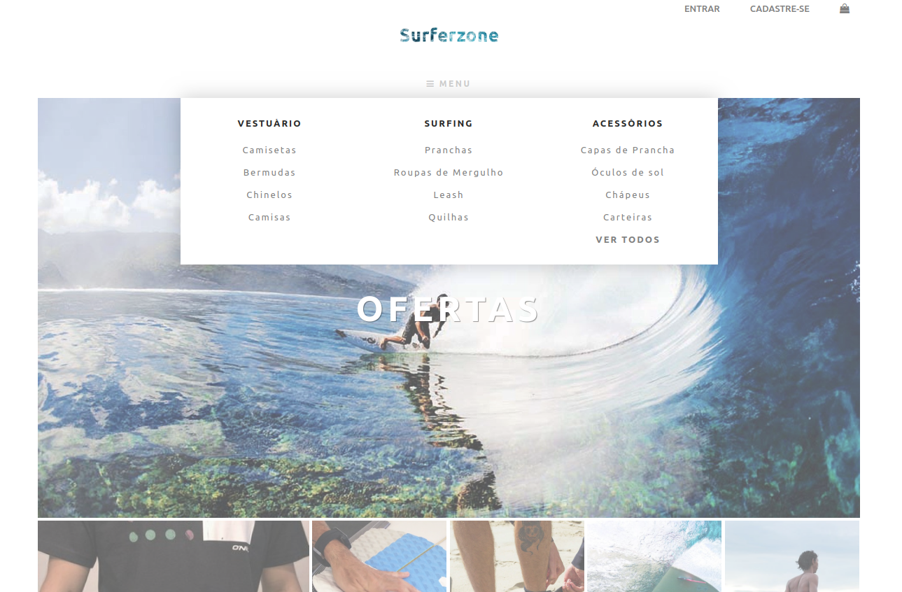

## Surferzone

Conceito de e-commerce dinâmico a área de administrativa para gerenciamento de produtos.

## Contribuidores

- João Vitor Barbosa Souza
- Leonardo Laurindo Martinez

## Requisitos

- PHP ou Pacotes compilados (Xampp, Wampp, Mampp, etc)
- MySQL
- NPM
- Composer
- [Laravel](https://laravel.com/docs/7.x/installation#server-requirements)


## Como instalar

Escolha um diretório de seu preferência e rode os seguintes comandos:

```bash
git clone https://github.com/jvbs/surferzone.git

cd surferzone/
```

Agora iremos instalar as dependências do projeto, utilizando os comandos:

```bash
composer install

npm install
```

Dentro do projeto, crie um arquivo `.env` na raiz do projeto (copie o conteúdo do `.env-example`), cole e, neste arquivo, altere as variáveis de ambiente para configurar seu banco de dados:

```bash
DB_HOST=MY_HOST
DB_PORT=MY_HOST_PORT
DB_DATABASE=MY_DB
DB_USERNAME=MY_USERNAME
DB_PASSWORD=MY_PASS
```
Crie uma chave para a aplicação e gere tabelas:
```bash
php artisan key:generate

php artisan storage:link

php artisan migrate

php artisan db:seed
```

Agora execute o comando para iniciar a ferramenta:
```bash
php artisan serve
```

E em outro terminal:
```bash
npm run watch
```
